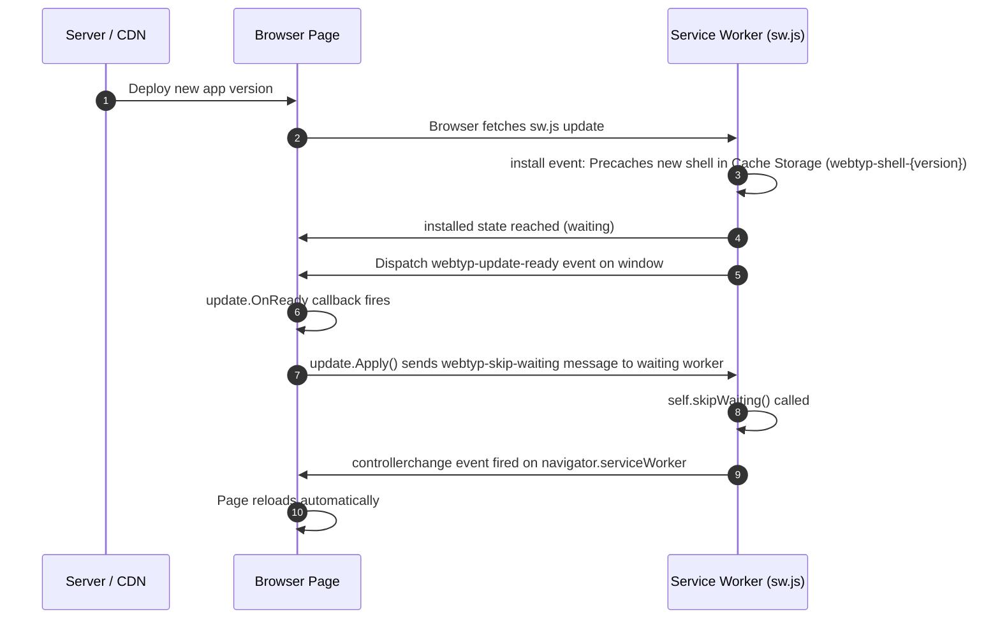

# Architecture & Design — `webtyp/pwa`

## Prior Art Comparison

- **Workbox (`workbox-build`)**: The bundler gives it emitted files; it writes a precache list (URL + revision) into the service worker. When a new worker waits, `workbox-window` tells the page so it can offer a reload.
  *What we take*: Precache list with revisions, wait-then-ask update model, and build-time generator package called by the bundler (`sitec`).
- **Angular `@angular/service-worker`**: The build writes `ngsw.json` (files + hashes); the hash of that table is the app version. `SwUpdate` notifies the app when a version is ready and activates it on reload.
  *What we take*: **Version = hash of the shell asset list**, ensuring one coherent set per application version.
- **SvelteKit `$service-worker`**: Exposes `build` (hashed files) and `version` used as the cache name.
  *What we take*: Cache name format (`CachePrefix` + version), with old caches cleaned up during service worker activation (`activate`).
- **Our Differences**: No runtime caching strategies, no plugin system, and no route configuration. `webtyp` emits a known, small shell, so we use one fixed strategy (precache + cache-first for exact shell URLs). Large artifacts (e.g., model weights) belong in `webtyp/artifacts` (OPFS), not Cache Storage.

## Update Sequence

## Why No `skipWaiting()` or `clients.claim()` on Install

Service workers generated by `webtyp/pwa` deliberately do **not** call `skipWaiting()` inside the `install` event handler and do **not** call `clients.claim()` inside `activate`.

A new service worker waits until the page explicitly calls `update.Apply()` (or reloads). This guarantees that a running page never executes HTML/JS from one version alongside `client.wasm` or assets from another version (Decision D-PWA-8).

## Scope & Non-Cached Assets

The service worker strictly caches URLs listed in the application shell (`SHELL` array). Any request not in `SHELL` (such as API endpoints, `/__webtyp/ca`, or large model weight artifacts in OPFS) passes through unaffected without service worker interception.

## HTTP Caching Headers

The HTTP server or CDN hosting the application (not this library) should apply the following cache headers:

- **Hashed Assets** (e.g., `/style.3f9a1c2b.css`, `/client.9a8b7c6d.wasm`):
  `Cache-Control: public, max-age=31536000, immutable`
- **Unversioned Shell Endpoints** (`/`, `/sw.js`, `/manifest.webmanifest`):
  `Cache-Control: no-cache`
